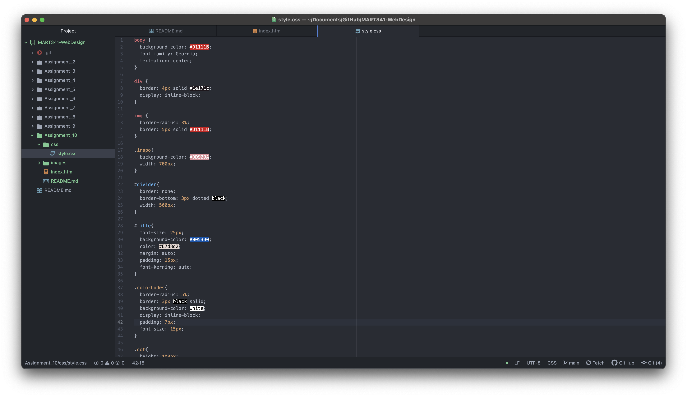

The difference between the universal, element, class, and id selector types is what is affected when styled. Going down the list of those four, they get more specific. You may use universal or element selectors when looking to style largely over all elements/specified elements. You may choose a class selector when you want to style a certain type of content that will be repeated throughout other pages/on the same page. On this weeks page, I made the palette and the main div the same class so that they were styled the same. You may choose an id selector when a very specific, single thing needs to be styled that won't be anywhere else on any other pages.

This week I chose my color palette by taking inspiration from one of my favorite screenprinters / artists, Patrick Caulfield. I really liked the contrasting reds and blues, especially in the details in the background of the blue. I went onto Coolors.co to select the palette from the photo I downloaded and used this week.

