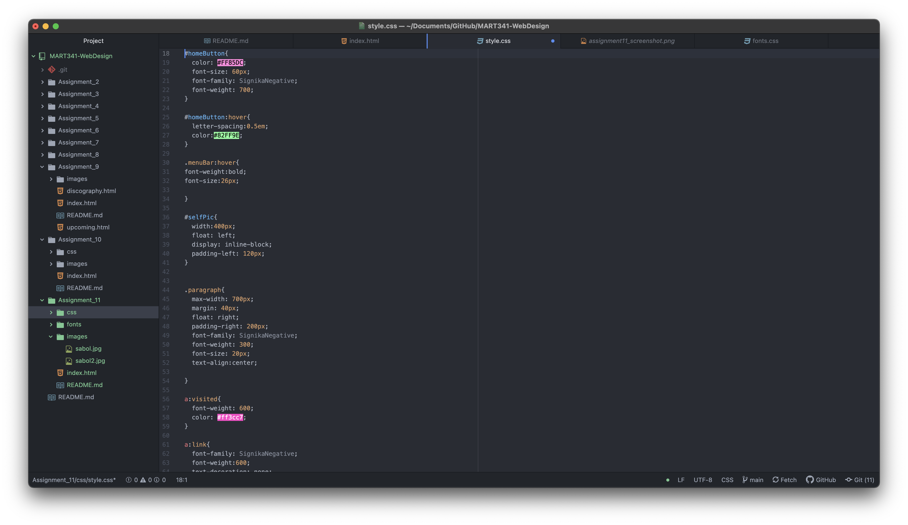

Typography is the art of type. It includes arranging it to make it best suit the purpose it aims to have, and as I've seen online multiple times, creating own typefaces and playing with the use of type as an art.

It's important to have fallback fonts or a font stack because if for some reason the primary font you choose is unable to load, whether it be on the browser's end or your end, that your content can still be displayed nicely. It's helpful to choose a fallback font with a similar size and x-height so that if the site needs to load it, it's transition doesn't create a flash for the user.

System fonts are those that are already installed on your system and are available in lots of programs, but not always for the web. A web font is a custom font hosted on a server. They require certain steps to get called correctly, as they do not have to be on a user's device to appear. A web-safe font is one that can adapt to any browser and any device, ensuring that those fonts will always be displayed as the developer intended.

