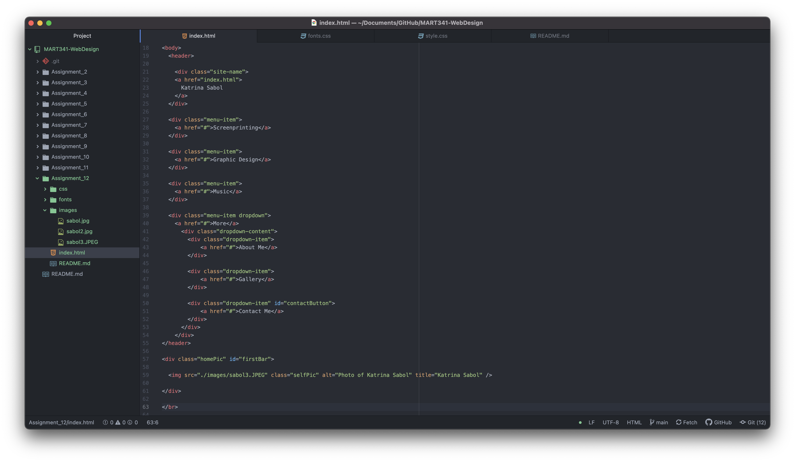

Padding is the amount of space between inner content of an element and the element itself. A margin is the space between an element and other elements/the parent element. A border is an edge around an element that you can style.

