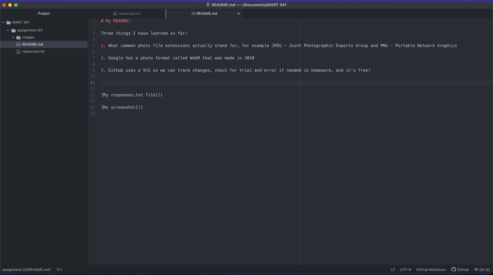

# My README!

Three things I have learned so far:

1. What common photo file extensions actually stand for, for example JPEG - Joint Photographic Experts Group and PNG - Portable Network Graphics

2. Google has a photo format called WebM that was made in 2010

3. Github uses a VCS so we can track changes, check for trial and error if needed in homework, and it's free!

[My responses.txt file](./responses.txt)

#### My screenshot!

