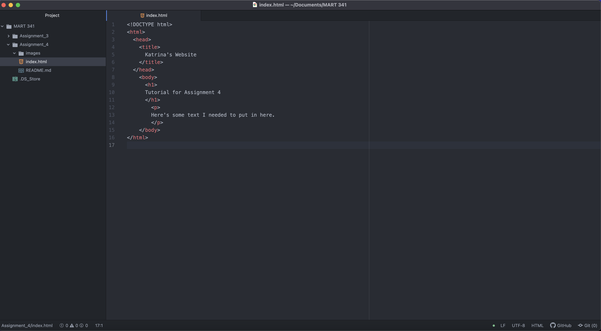

1.) Very simply, browsers work by interpreting the web content that comes from a server that you request information from and putting it on a page for display. They also give us tabs and arrows to navigate through pages. I have always used Google Chrome and probably always will.

# My Screenshot (:

