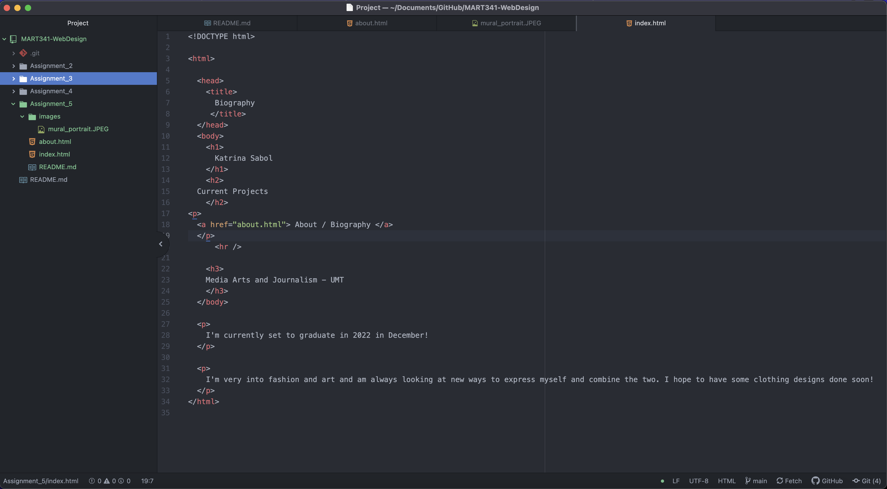

I visited Soundcloud's website from 2010 on The Wayback Machine. It is completely different from how it is now, as there wasn't really any distinct menu bar or areas where different features can be accessed. The widgets and phrases on the old website are corny and it feels almost parody but it's not. The new one is more sleek, and offers you everything more modernly.

