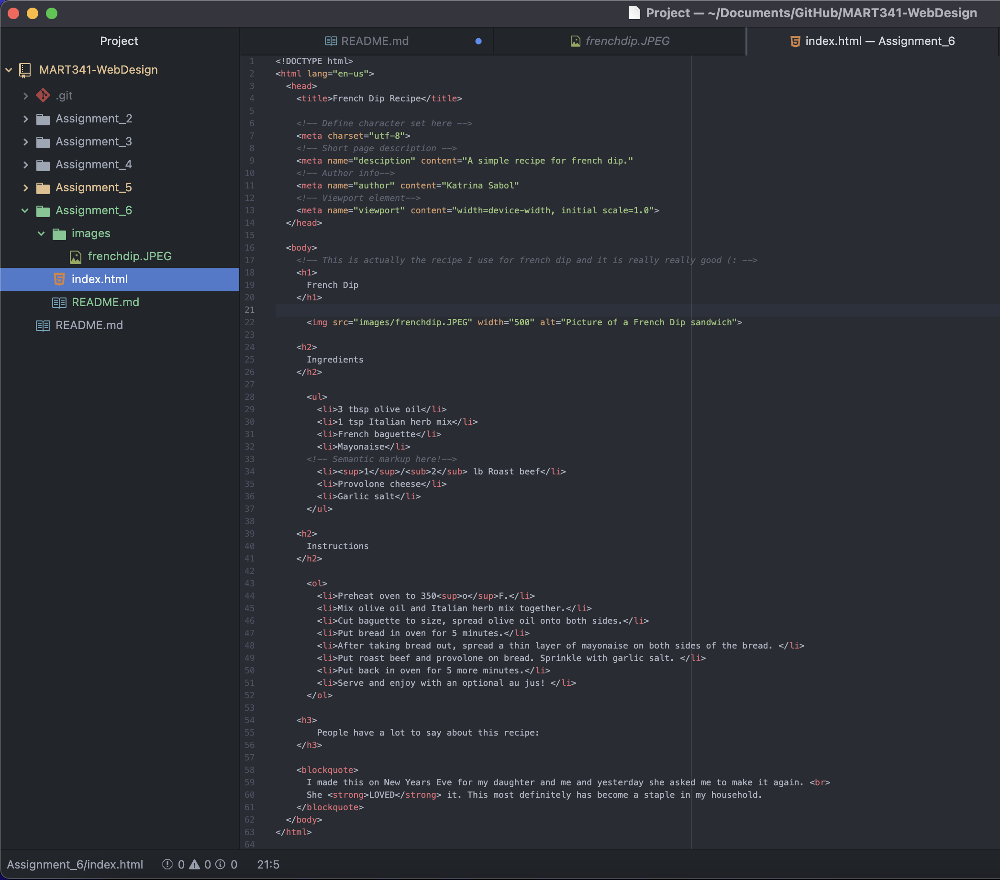

Structural markup has to do with the actual structure of a document, including elements like headings, paragraphs, and lists. Semantic markup is used to reinforce the meaning of the information in a document, by placing certain emphasis on a word or phrase. It uses elements like words being "strong," in quotes, and definitions.

