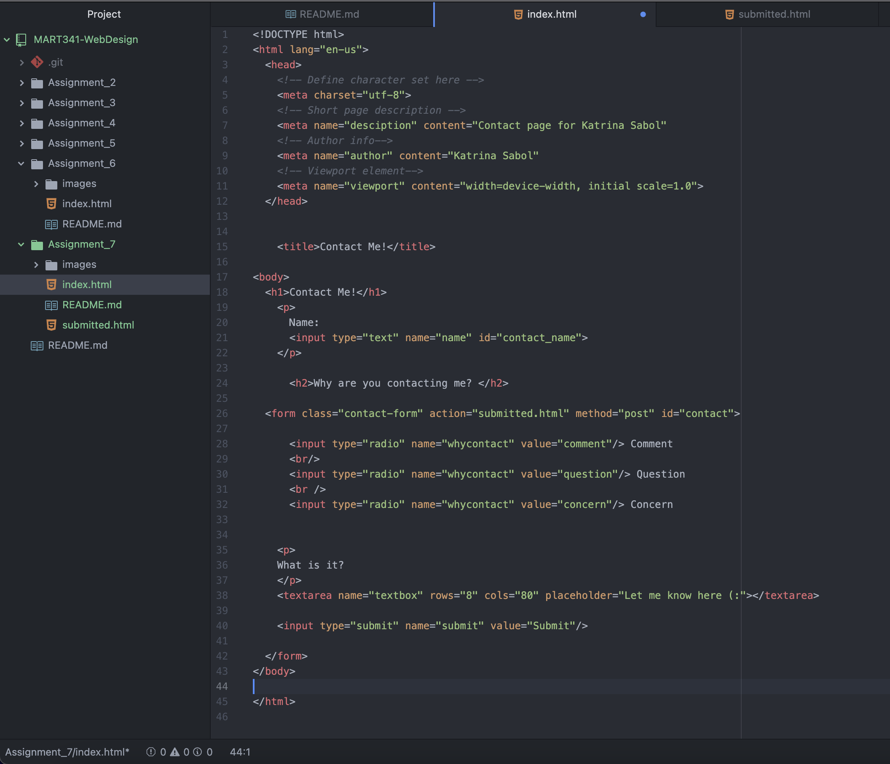

I've come across all of the different form types that the website described. They all serve different purposes and are also sometimes used together. For every assignment this year, we have had to submit a text entry and click the submit button, so the application is even seen in our class. Sometimes a user needs to submit information freely, but sometimes it's important that the choice be restricted.

