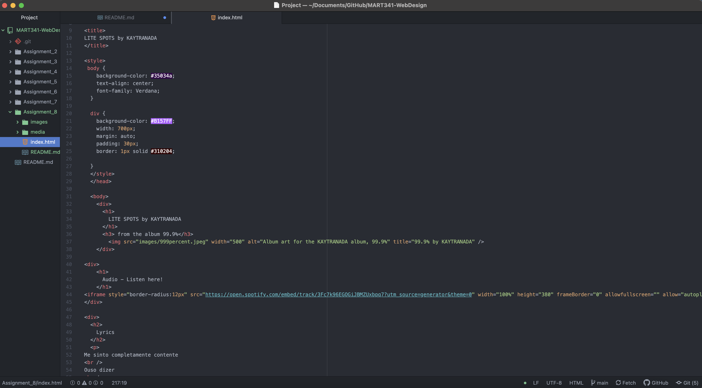

An affordance is the perceived property of something. Physical objects, or in our case digital ones, can have many different affordances, although digital ones are inflexible compared to physical ones, which is why they must be learned.

Some advantages to using a third-party video hosting service like YouTube or Vimeo includes having your video be shown on their websites (if listed) and not having to store the file on your own server so it saves you space. Some disadvantages are slower response times when the video is first clicked to when it begins to play, possible ad interruptions, and not having content that is directly hosted subjecting you to less views to your site.

