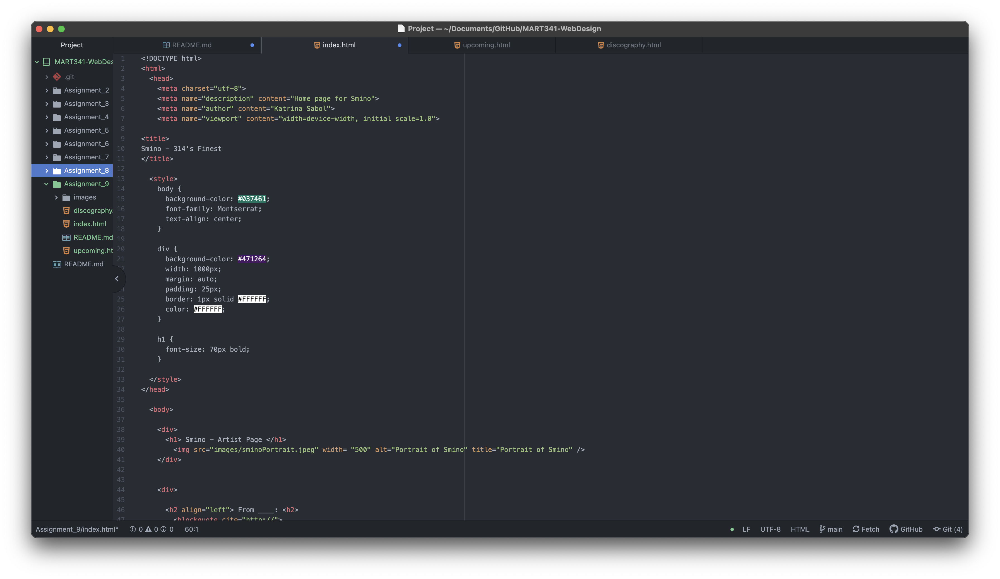

My experience in HTML was overall pretty good. I don't remember anything from the creative coding class predecessor of this class as I took it my first semester of college in 2019. I think this class has been better about explaining HTML, maybe because there is exclusive focus on the web development area versus everything else you're introduced to in creative coding. All of the different tags and attributes were / are difficult for me to learn because of how many there are and how certain attributes need to be set up to be able to make a page function in the way that I want. That one style week was really heavy so I think I'm still trying to fully absorb all of the content from then. This week I struggled on figuring out how to make my nav bar be consistent throughout all of the pages. I checked a lot of online sources but still couldn't get it right. I think I might have issues with my div elements or photos pushing it back, but after playing around with those I'm still unsure.

I think I'm nervous to learn about styling because we went through all of HTML so quickly, but from what we've done with styling thus far I think I will be able to do it okay. Something I've definitely learned from this class, as well as others in the SVMA, is making your code/directories neat is important. I know with CSS I will have to continue to keep this up to make it easiest for me to navigate through everything.

